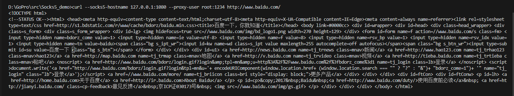

# Socks5_demo
使用socks5协议在本地的1080进行代理转发（只容许80端口服务的转发）。
##  测试
```
curl --socks5-hostname 127.0.0.1:1080 --proxy-user root:1234 http://www.baidu.com/
```


- --proxy-user 选项来指定用户名和密码。
 
- --socks5-hostname 选项，该选项可以让curl使用SOCKS5代理来进行域名解析。请注意，这需要curl版本7.21.7或更高版本才支持。 